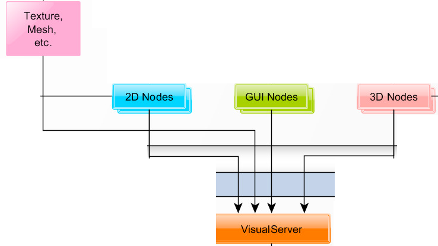

<!-- _class: lead -->
# Graphics Rendering
### Guest Lecturer Tristen MacPherson

<div style="display:flex;justify-content:center;">
  <canvas id="shader-canvas-8" width="520" height="320" style="width:85%;max-width:640px;aspect-ratio:13/8;border-radius:12px;background:#010101;box-shadow:0 12px 24px rgba(0,0,0,0.55);"></canvas>
</div>

<script>
(function(){
  const canvas = document.getElementById('shader-canvas-8');
  const gl = canvas.getContext('webgl'); if(!gl) return;
  const quad = new Float32Array([-1,-1,1,-1,-1,1,1,1]);
  const vs = `attribute vec2 position; varying vec2 vUV; void main(){ vUV = position; gl_Position = vec4(position,0.0,1.0);} `;
  const fs = `
    precision mediump float;
    varying vec2 vUV;
    uniform float u_time;
    float hash(vec2 p){ return fract(sin(dot(p, vec2(23.1407, 2.6651))) * 43758.5453); }
    vec2 flow(vec2 p, float t){
      float angle = sin(p.x*3.2 + t*0.6) + cos(p.y*2.7 - t*0.4);
      angle += hash(p*4.0) * 0.5;
      float speed = 0.2 + 0.8 * abs(sin(p.x*2.0 - p.y*1.7 + t*0.3));
      return vec2(cos(angle), sin(angle)) * speed;
    }
    vec3 palette(float t){
      vec3 deep = vec3(0.05,0.08,0.15);
      vec3 teal = vec3(0.05,0.6,0.9);
      vec3 magenta = vec3(0.8,0.2,0.9);
      vec3 glow = vec3(1.0,0.9,0.4);
      vec3 blend = mix(deep, teal, smoothstep(0.0, 0.5, t));
      blend = mix(blend, magenta, smoothstep(0.3, 0.9, t));
      return mix(blend, glow, pow(t, 4.0));
    }
    void main(){
      vec2 uv = vUV * 2.0 - 1.0;
      vec2 p = uv;
      vec3 col = vec3(0.0);
      float trace = 0.0;
      float t = u_time * 0.3;
      for(int i=0;i<64;i++){
        vec2 dir = flow(p, t + float(i)*0.02);
        p += dir * 0.015;
        float weight = float(i)/64.0;
        float fade = exp(-length(p)*1.2);
        col += palette(weight) * fade * (0.8 + 0.4*sin(float(i)*0.05 + t*2.0));
        trace += fade;
      }
      float pulse = 0.5 + 0.5 * sin(u_time * 0.8);
      vec2 orbit = vec2(sin(t*2.0), cos(t*1.5)) * 0.4;
      float highlight = exp(-length(uv - orbit) * 6.0);
      col = col / (trace + 0.0001);
      col = pow(col * 1.6, vec3(0.85));
      col += highlight * vec3(0.9, 0.4, 1.0) * 0.6;
      col += pulse * 0.05;
      gl_FragColor = vec4(col, 1.0);
    }
  `;
  const program = gl.createProgram();
  function compile(t,s){const sh=gl.createShader(t);gl.shaderSource(sh,s);gl.compileShader(sh);return sh;}
  gl.attachShader(program, compile(gl.VERTEX_SHADER, vs));
  gl.attachShader(program, compile(gl.FRAGMENT_SHADER, fs));
  gl.linkProgram(program);
  gl.useProgram(program);
  const buffer=gl.createBuffer();
  gl.bindBuffer(gl.ARRAY_BUFFER, buffer);
  gl.bufferData(gl.ARRAY_BUFFER, quad, gl.STATIC_DRAW);
  const pos=gl.getAttribLocation(program,'position');
  gl.vertexAttribPointer(pos,2,gl.FLOAT,false,0,0);
  gl.enableVertexAttribArray(pos);
  const timeLoc=gl.getUniformLocation(program,'u_time');
  function render(time){
    gl.uniform1f(timeLoc,time*0.001);
    gl.drawArrays(gl.TRIANGLE_STRIP,0,4);
    requestAnimationFrame(render);
  }
  requestAnimationFrame(render);
})();
</script>

---
## High level overview
- CPU prepares the work then sends: commands, code (shaders), and data through a graphics API
- GPU processes this data in parallel and renders the results

<div style="display:flex;justify-content:center;">
  <canvas id="shader-palette-flow" width="520" height="320"
    style="width:85%;max-width:640px;aspect-ratio:13/8;border-radius:14px;
           background:#020205;box-shadow:0 16px 32px rgba(0,0,0,0.7);">
  </canvas>
</div>

<script>
(function(){
  const canvas = document.getElementById('shader-palette-flow');
  if (!canvas) return;
  const gl = canvas.getContext('webgl');
  if (!gl) return;

  const quad = new Float32Array([
    -1, -1,
     1, -1,
    -1,  1,
     1,  1,
  ]);

  const vs = `
    attribute vec2 position;
    varying vec2 vUV;
    void main(){
      vUV = position * 0.5 + 0.5;
      gl_Position = vec4(position, 0.0, 1.0);
    }
  `;

  const fs = `
    precision mediump float;
    varying vec2 vUV;
    uniform float u_time;
    uniform vec2 u_resolution;

    #define iTime u_time
    #define iResolution vec3(u_resolution, 1.0)

    vec3 palette(float t){
      vec3 a = vec3(0.5);
      vec3 b = vec3(0.5);
      vec3 c = vec3(1.0);
      vec3 d = vec3(0.263, 0.416, 0.557);
      return a + b * cos(6.28318 * (c * t + d));
    }

    void main(){
      vec2 fragCoord = vUV * u_resolution;
      vec2 uv = (fragCoord * 2.0 - iResolution.xy) / iResolution.y;
      vec2 uv0 = uv;
      vec3 finalColor = vec3(0.0);

      for(float i = 0.0; i < 4.0; i++){
        uv = fract(uv * 1.5) - 0.5;
        float d = length(uv) * exp(-length(uv0));
        vec3 col = palette(length(uv0) + i * 0.4 + iTime * 0.4);
        d = sin(d * 8.0 + iTime) / 8.0;
        d = abs(d);
        d = pow(0.01 / d, 1.2);
        finalColor += col * d;
      }

      gl_FragColor = vec4(finalColor, 1.0);
    }
  `;

  function compile(type, source){
    const shader = gl.createShader(type);
    gl.shaderSource(shader, source);
    gl.compileShader(shader);
    if (!gl.getShaderParameter(shader, gl.COMPILE_STATUS)) {
      console.error(gl.getShaderInfoLog(shader));
      return null;
    }
    return shader;
  }

  const program = gl.createProgram();
  const vsHandle = compile(gl.VERTEX_SHADER, vs);
  const fsHandle = compile(gl.FRAGMENT_SHADER, fs);
  if (!vsHandle || !fsHandle) return;
  gl.attachShader(program, vsHandle);
  gl.attachShader(program, fsHandle);
  gl.linkProgram(program);
  if (!gl.getProgramParameter(program, gl.LINK_STATUS)) {
    console.error(gl.getProgramInfoLog(program));
    return;
  }
  gl.useProgram(program);

  const buffer = gl.createBuffer();
  gl.bindBuffer(gl.ARRAY_BUFFER, buffer);
  gl.bufferData(gl.ARRAY_BUFFER, quad, gl.STATIC_DRAW);

  const posLoc = gl.getAttribLocation(program, 'position');
  gl.vertexAttribPointer(posLoc, 2, gl.FLOAT, false, 0, 0);
  gl.enableVertexAttribArray(posLoc);

  const timeLoc = gl.getUniformLocation(program, 'u_time');
  const resLoc = gl.getUniformLocation(program, 'u_resolution');

  const start = performance.now();

  function render(time){
    gl.viewport(0, 0, canvas.width, canvas.height);
    gl.uniform1f(timeLoc, (time - start) * 0.001);
    gl.uniform2f(resLoc, canvas.width, canvas.height);
    gl.drawArrays(gl.TRIANGLE_STRIP, 0, 4);
    requestAnimationFrame(render);
  }

  requestAnimationFrame(render);
})();
</script>
---
## CPU Preparation for the GPU 
- loading assets (textures, shaders, models)
- configuring data
- preparing instructions

<div style="display:flex;justify-content:center;">
  <canvas id="shader-canvas-7" width="520" height="320" style="width:85%;max-width:640px;aspect-ratio:13/8;border-radius:12px;background:#010101;box-shadow:0 12px 24px rgba(0,0,0,0.55);"></canvas>
</div>

<script>
(function(){
  const canvas = document.getElementById('shader-canvas-7');
  const gl = canvas.getContext('webgl'); if(!gl) return;
  const quad = new Float32Array([-1,-1,1,-1,-1,1,1,1]);
  const vs = `attribute vec2 position; varying vec2 vUV; void main(){ vUV = position; gl_Position = vec4(position,0.0,1.0);} `;
  const fs = `
    precision mediump float;
    varying vec2 vUV;
    uniform float u_time;
    float blob(vec2 p, vec2 center, float radius){
      return exp(-dot(p-center, p-center) * radius);
    }
    void main(){
      vec2 uv = vUV * 1.2;
      vec2 center1 = vec2(sin(u_time*0.6), cos(u_time*0.6))*0.4;
      vec2 center2 = vec2(sin(u_time*0.4+2.0), cos(u_time*0.5+1.0))*0.5;
      float field = blob(uv, center1, 5.0) + blob(uv, center2, 6.0);
      vec3 color = mix(vec3(0.05,0.0,0.1), vec3(0.8,0.2,0.9), field);
      gl_FragColor = vec4(color, 1.0);
    }
  `;
  const program = gl.createProgram();
  function compile(t,s){const sh=gl.createShader(t);gl.shaderSource(sh,s);gl.compileShader(sh);return sh;}
  gl.attachShader(program, compile(gl.VERTEX_SHADER, vs));
  gl.attachShader(program, compile(gl.FRAGMENT_SHADER, fs));
  gl.linkProgram(program);
  gl.useProgram(program);
  const buffer=gl.createBuffer();
  gl.bindBuffer(gl.ARRAY_BUFFER, buffer);
  gl.bufferData(gl.ARRAY_BUFFER, quad, gl.STATIC_DRAW);
  const pos=gl.getAttribLocation(program,'position');
  gl.vertexAttribPointer(pos,2,gl.FLOAT,false,0,0);
  gl.enableVertexAttribArray(pos);
  const timeLoc=gl.getUniformLocation(program,'u_time');
  function render(time){
    gl.uniform1f(timeLoc,time*0.001);
    gl.drawArrays(gl.TRIANGLE_STRIP,0,4);
    requestAnimationFrame(render);
  }
  requestAnimationFrame(render);
})();
</script>

---
## Command Buffer & API Calls
- CPU uses a graphics API (like OpenGL, Vulkan, DirectX, or Metal) to communicate with the GPU. 
- These APIs allow the CPU to send commands to the GPU, such as rendering instructions or memory allocations. 
- These commands are stored in a command buffer, which acts as a queue for the GPU.


<div style="display:flex;justify-content:center;">
  <canvas id="shader-canvas-1" width="520" height="320" style="width:85%;max-width:640px;aspect-ratio:13/8;border-radius:12px;background:#010101;box-shadow:0 12px 24px rgba(0,0,0,0.55);"></canvas>
</div>

<script>
(function () {
  const canvas = document.getElementById('shader-canvas-1');
  const gl = canvas.getContext('webgl');
  if (!gl) return;

  const quad = new Float32Array([
    -1, -1,
     1, -1,
    -1,  1,
     1,  1,
  ]);

  const vs = `
    attribute vec2 position;
    varying vec2 vUV;
    void main() {
      vUV = position * 0.5 + 0.5;
      gl_Position = vec4(position, 0.0, 1.0);
    }
  `;

  const fs = `
    precision mediump float;
    varying vec2 vUV;
    uniform float u_time;
    void main() {
      float wave = sin(vUV.x * 10.0 + u_time) + cos(vUV.y * 12.0 - u_time * 0.7);
      float colorShift = sin(u_time * 0.5 + vUV.y * 5.0);
      vec3 base = vec3(0.1, 0.2, 0.5) + 0.5 * vec3(wave);
      vec3 accent = vec3(0.9, 0.3, 0.1) * (0.5 + 0.5 * colorShift);
      gl_FragColor = vec4(base + accent, 1.0);
    }
  `;

  function compile(type, source) {
    const shader = gl.createShader(type);
    gl.shaderSource(shader, source);
    gl.compileShader(shader);
    return shader;
  }

  const program = gl.createProgram();
  gl.attachShader(program, compile(gl.VERTEX_SHADER, vs));
  gl.attachShader(program, compile(gl.FRAGMENT_SHADER, fs));
  gl.linkProgram(program);
  gl.useProgram(program);

  const buffer = gl.createBuffer();
  gl.bindBuffer(gl.ARRAY_BUFFER, buffer);
  gl.bufferData(gl.ARRAY_BUFFER, quad, gl.STATIC_DRAW);

  const positionLoc = gl.getAttribLocation(program, 'position');
  gl.vertexAttribPointer(positionLoc, 2, gl.FLOAT, false, 0, 0);
  gl.enableVertexAttribArray(positionLoc);

  const timeLoc = gl.getUniformLocation(program, 'u_time');

  function render(time) {
    gl.viewport(0, 0, canvas.width, canvas.height);
    gl.clear(gl.COLOR_BUFFER_BIT);
    gl.uniform1f(timeLoc, time * 0.001);
    gl.drawArrays(gl.TRIANGLE_STRIP, 0, 4);
    requestAnimationFrame(render);
  }
  requestAnimationFrame(render);
})();
</script>

---
## Parallel Processing on the GPU: 
- The GPU, designed for parallel computation, processes many data points (like pixels or vertices) simultaneously using its many cores. 
- Which makes it highly efficient for tasks like rendering complex 3D scenes, image processing, or physics simulations.

<div style="display:flex;justify-content:center;">
  <canvas id="shader-canvas-clouds" width="520" height="320" style="width:85%;max-width:640px;aspect-ratio:13/8;border-radius:12px;background:#07121f;box-shadow:0 12px 24px rgba(0,0,0,0.55);"></canvas>
</div>

<script>
(function(){
  const canvas = document.getElementById('shader-canvas-clouds');
  if(!canvas) return;
  const gl = canvas.getContext('webgl');
  if(!gl) return;

  const quad = new Float32Array([-1,-1,1,-1,-1,1,1,1]);
  const vs = `attribute vec2 position; varying vec2 vUV; void main(){ vUV = position; gl_Position = vec4(position,0.0,1.0);} `;
  const fs = `
    precision mediump float;
    varying vec2 vUV;
    uniform float u_time;
    float hash(vec2 p){ return fract(sin(dot(p, vec2(127.1,311.7))) * 43758.5453);
    }
    float noise(vec2 p){
      vec2 i = floor(p);
      vec2 f = fract(p);
      float a = hash(i);
      float b = hash(i + vec2(1.0, 0.0));
      float c = hash(i + vec2(0.0, 1.0));
      float d = hash(i + vec2(1.0, 1.0));
      vec2 u = f * f * (3.0 - 2.0 * f);
      return mix(a, b, u.x) + (c - a) * u.y * (1.0 - u.x) + (d - b) * u.x * u.y;
    }
    float fbm(vec2 p){
      float value = 0.0;
      float amp = 0.5;
      for(int i=0;i<5;i++){
        value += amp * noise(p);
        p *= 2.3;
        amp *= 0.5;
      }
      return value;
    }
    void main(){
      vec2 uv = vUV;
      float t = u_time * 0.04;
      vec2 move = vec2(t * 0.8, t);
      float clouds = fbm(uv * 2.5 + move);
      float wisps = fbm(uv * 6.0 - move * 1.7);
      float density = smoothstep(0.2, 0.85, clouds + wisps * 0.5);
      vec3 horizon = mix(vec3(0.03,0.07,0.14), vec3(0.1,0.2,0.35), uv.y + 0.15);
      vec3 cloudColor = mix(vec3(0.7,0.8,0.9), vec3(0.95,0.99,1.0), uv.y + 0.1);
      vec3 color = mix(horizon, cloudColor, density);
      color += 0.05 * sin(vec3(1.0,1.3,1.7) * (u_time*0.12 + uv.y*2.0));
      gl_FragColor = vec4(color, 1.0);
    }
  `;

  const program = gl.createProgram();
  function compile(type, source){
    const shader = gl.createShader(type);
    gl.shaderSource(shader, source);
    gl.compileShader(shader);
    return shader;
  }

  gl.attachShader(program, compile(gl.VERTEX_SHADER, vs));
  gl.attachShader(program, compile(gl.FRAGMENT_SHADER, fs));
  gl.linkProgram(program);
  gl.useProgram(program);

  const buffer = gl.createBuffer();
  gl.bindBuffer(gl.ARRAY_BUFFER, buffer);
  gl.bufferData(gl.ARRAY_BUFFER, quad, gl.STATIC_DRAW);

  const pos = gl.getAttribLocation(program, 'position');
  gl.vertexAttribPointer(pos, 2, gl.FLOAT, false, 0, 0);
  gl.enableVertexAttribArray(pos);

  const timeLoc = gl.getUniformLocation(program, 'u_time');

  function render(time){
    gl.viewport(0, 0, canvas.width, canvas.height);
    gl.uniform1f(timeLoc, time * 0.001);
    gl.drawArrays(gl.TRIANGLE_STRIP, 0, 4);
    requestAnimationFrame(render);
  }

  requestAnimationFrame(render);
})();
</script>


---
## Synchronization: 
- The CPU and GPU often work asynchronously, meaning the CPU can continue with other tasks while the GPU is rendering. 
- The graphics API includes mechanisms for synchronization to ensure that the GPU completes its tasks before moving on to the next frame or job.


<div style="display:flex;justify-content:center;">
  <canvas id="shader-canvas-4" width="520" height="320" style="width:85%;max-width:640px;aspect-ratio:13/8;border-radius:12px;background:#010101;box-shadow:0 12px 24px rgba(0,0,0,0.55);"></canvas>
</div>

<script>
(function () {
  const canvas = document.getElementById('shader-canvas-4');
  const gl = canvas.getContext('webgl');
  if (!gl) return;

  const quad = new Float32Array([-1,-1,  1,-1,  -1,1,  1,1]);
  const vs = `
    attribute vec2 position;
    varying vec2 vUV;
    void main(){ vUV = position * 0.5 + 0.5; gl_Position = vec4(position,0.0,1.0); }
  `;
  const fs = `
    precision mediump float;
    varying vec2 vUV;
    uniform float u_time;
    float hash(vec2 p){ return fract(sin(dot(p, vec2(12.9898,78.233))) * 43758.5453); }
    float noise(vec2 p){
      vec2 i = floor(p);
      vec2 f = fract(p);
      float a = hash(i);
      float b = hash(i + vec2(1.0, 0.0));
      float c = hash(i + vec2(0.0, 1.0));
      float d = hash(i + vec2(1.0, 1.0));
      vec2 u = f * f * (3.0 - 2.0 * f);
      return mix(a, b, u.x) + (c - a) * u.y * (1.0 - u.x) + (d - b) * u.x * u.y;
    }
    float fbm(vec2 p){
      float value = 0.0;
      float amp = 0.5;
      for(int i=0;i<4;i++){
        value += amp * noise(p);
        p *= 2.3;
        amp *= 0.5;
      }
      return value;
    }
    void main(){
      float t = u_time * 0.25;
      vec2 uv = vec2(vUV.x * 2.5 - 1.2, vUV.y * 1.3);
      float bands = sin(uv.x * 5.5 + fbm(vec2(uv.y * 3.0 + t, t)) * 4.0 + t * 2.0);
      float shimmer = fbm(vec2(uv.x * 6.0 - t, uv.y * 8.0 + t));
      vec3 base = mix(vec3(0.0,0.05,0.15), vec3(0.05,0.2,0.4), vUV.y);
      vec3 aurora = mix(vec3(0.1,0.4,0.8), vec3(0.2,1.0,0.7), 0.6 + 0.4 * bands);
      aurora += shimmer * vec3(0.05,0.5,0.3);
      float curtain = pow(1.0 - abs(vUV.y - 0.35) * 1.8, 5.0);
      vec3 col = base + aurora * curtain;
      col += 0.2 * curtain * vec3(0.2,0.8,1.0);
      gl_FragColor = vec4(col, 1.0);
    }
  `;
  const program = gl.createProgram();
  function compile(t,s){ const sh = gl.createShader(t); gl.shaderSource(sh,s); gl.compileShader(sh); return sh; }
  gl.attachShader(program, compile(gl.VERTEX_SHADER, vs));
  gl.attachShader(program, compile(gl.FRAGMENT_SHADER, fs));
  gl.linkProgram(program);
  gl.useProgram(program);
  const buffer = gl.createBuffer();
  gl.bindBuffer(gl.ARRAY_BUFFER, buffer);
  gl.bufferData(gl.ARRAY_BUFFER, quad, gl.STATIC_DRAW);
  const pos = gl.getAttribLocation(program, 'position');
  gl.vertexAttribPointer(pos, 2, gl.FLOAT, false, 0, 0);
  gl.enableVertexAttribArray(pos);
  const timeLoc = gl.getUniformLocation(program, 'u_time');
  function render(time){
    gl.uniform1f(timeLoc, time*0.001);
    gl.drawArrays(gl.TRIANGLE_STRIP, 0, 4);
    requestAnimationFrame(render);
  }
  requestAnimationFrame(render);
})();
</script>


---
## Rendering Output: 
- Once the GPU finishes processing, it can output the rendered image to a buffer.  Framebuffer (main target), render target, or other buffers.  
- The results can then be composited and displayed on the screen.

<div style="display:flex;justify-content:center;">
  <canvas id="shader-canvas-2" width="520" height="320" style="width:85%;max-width:640px;aspect-ratio:13/8;border-radius:12px;background:#010101;box-shadow:0 12px 24px rgba(0,0,0,0.55);"></canvas>
</div>

<script>
(function () {
  const canvas = document.getElementById('shader-canvas-2');
  const gl = canvas.getContext('webgl');
  if (!gl) return;

  const vertices = new Float32Array([
    -1, -1,
     1, -1,
    -1,  1,
     1,  1,
  ]);

  const vs = `
    attribute vec2 position;
    varying vec2 vUV;
    void main() {
      vUV = position * 0.5 + 0.5;
      gl_Position = vec4(position, 0.0, 1.0);
    }
  `;

  const fs = `
    precision mediump float;
    varying vec2 vUV;
    uniform float u_time;
    void main() {
      vec2 uv = vUV * 2.0 - 1.0;
      float dist = length(uv);
      float ripple = sin(12.0 * dist - u_time * 2.0);
      float glow = exp(-3.0 * dist);
      vec3 color = mix(vec3(0.0, 0.2, 0.3), vec3(0.2, 0.9, 0.7), 0.5 + 0.5 * ripple);
      color += glow * vec3(0.9, 0.8, 0.3);
      gl_FragColor = vec4(color, 1.0);
    }
  `;

  function compile(type, source) {
    const shader = gl.createShader(type);
    gl.shaderSource(shader, source);
    gl.compileShader(shader);
    return shader;
  }

  const program = gl.createProgram();
  gl.attachShader(program, compile(gl.VERTEX_SHADER, vs));
  gl.attachShader(program, compile(gl.FRAGMENT_SHADER, fs));
  gl.linkProgram(program);
  gl.useProgram(program);

  const buffer = gl.createBuffer();
  gl.bindBuffer(gl.ARRAY_BUFFER, buffer);
  gl.bufferData(gl.ARRAY_BUFFER, vertices, gl.STATIC_DRAW);

  const position = gl.getAttribLocation(program, 'position');
  gl.vertexAttribPointer(position, 2, gl.FLOAT, false, 0, 0);
  gl.enableVertexAttribArray(position);

  const timeLoc = gl.getUniformLocation(program, 'u_time');

  function render(time) {
    gl.uniform1f(timeLoc, time * 0.001);
    gl.drawArrays(gl.TRIANGLE_STRIP, 0, 4);
    requestAnimationFrame(render);
  }
  requestAnimationFrame(render);
})();
</script>


---
## Godot CPU Preparation: 
- SceneTree
- Resources like textures and meshes (vertices)
- Nodes like MeshInstance2D or Node2D handle drawable objects
- Camera nodes and light nodes configure viewports and lighting for rendering

<div style="display:flex;justify-content:center;">
  <canvas id="shader-canvas-scenetree" width="520" height="320" style="width:85%;max-width:640px;aspect-ratio:13/8;border-radius:12px;background:#010101;box-shadow:0 12px 24px rgba(0,0,0,0.55);"></canvas>
</div>

<script>
(function () {
  const canvas = document.getElementById('shader-canvas-scenetree');
  const gl = canvas.getContext('webgl');
  if (!gl) return;

  const quad = new Float32Array([-1, -1, 1, -1, -1, 1, 1, 1]);
  const vs = `attribute vec2 position; varying vec2 vUV; void main() { vUV = position*0.5+0.5; gl_Position = vec4(position, 0.0, 1.0); }`;
  const fs = `
    precision mediump float;
    varying vec2 vUV;
    uniform float u_time;
    
    float hash(vec2 p){ return fract(sin(dot(p, vec2(127.1, 311.7))) * 43758.5453); }
    
    float noise(vec2 p){
      vec2 i = floor(p);
      vec2 f = fract(p);
      vec2 u = f * f * (3.0 - 2.0 * f);
      float n0 = mix(hash(i), hash(i + vec2(1.0, 0.0)), u.x);
      float n1 = mix(hash(i + vec2(0.0, 1.0)), hash(i + vec2(1.0, 1.0)), u.x);
      return mix(n0, n1, u.y);
    }
    
    float fbm(vec2 p){
      float value = 0.0;
      float amp = 0.5;
      for(int i = 0; i < 6; i++){
        value += amp * noise(p);
        p *= 2.0;
        amp *= 0.5;
      }
      return value;
    }
    
    void main(){
      vec2 uv = vUV;
      float t = u_time * 0.3;
      
      vec2 p = uv * 3.0;
      p += vec2(sin(t * 0.3) * 2.0, cos(t * 0.25) * 2.0);
      
      float n1 = fbm(p + t * 0.5);
      float n2 = fbm(p * 1.5 - t * 0.3 + 10.0);
      float n3 = fbm(p * 0.8 + t * 0.4 + 20.0);
      
      float pattern = sin(n1 * 6.28 - t * 2.0) * 0.5 + 0.5;
      pattern = mix(pattern, n2, 0.3);
      
      vec3 col = vec3(0.0);
      
      col += mix(vec3(0.9, 0.3, 0.6), vec3(1.0, 0.2, 0.8), pattern);
      col += mix(vec3(0.2, 0.8, 1.0), vec3(0.4, 0.9, 0.95), sin(n3 * 3.14 + t));
      
      vec2 swirl = vec2(sin(uv.y * 5.0 - t + uv.x * 3.0), cos(uv.x * 5.0 + t * 0.7 + uv.y * 3.0)) * 0.1;
      float dist = length(uv - 0.5 + swirl);
      
      col *= mix(1.2, 0.5, smoothstep(0.0, 1.0, dist));
      col += 0.3 * vec3(sin(t * 1.3), sin(t * 1.7 + 2.0), sin(t * 1.1 + 4.0)) * n1;
      col = pow(col, vec3(0.85));
      
      float chromatic = 0.015 * sin(t * 0.5);
      float r = fbm(uv * 2.5 + t + chromatic);
      float g = fbm(uv * 2.5 + t);
      float b = fbm(uv * 2.5 + t - chromatic);
      col += 0.2 * vec3(r, g, b) * (0.5 + 0.5 * sin(t * 2.0));
      
      gl_FragColor = vec4(col, 1.0);
    }
  `;

  const program = gl.createProgram();
  function compile(type, source) {
    const shader = gl.createShader(type);
    gl.shaderSource(shader, source);
    gl.compileShader(shader);
    return shader;
  }
  gl.attachShader(program, compile(gl.VERTEX_SHADER, vs));
  gl.attachShader(program, compile(gl.FRAGMENT_SHADER, fs));
  gl.linkProgram(program);
  gl.useProgram(program);

  const buffer = gl.createBuffer();
  gl.bindBuffer(gl.ARRAY_BUFFER, buffer);
  gl.bufferData(gl.ARRAY_BUFFER, quad, gl.STATIC_DRAW);

  const pos = gl.getAttribLocation(program, 'position');
  gl.vertexAttribPointer(pos, 2, gl.FLOAT, false, 0, 0);
  gl.enableVertexAttribArray(pos);

  const timeLoc = gl.getUniformLocation(program, 'u_time');

  function render(time) {
    gl.uniform1f(timeLoc, time * 0.001);
    gl.drawArrays(gl.TRIANGLE_STRIP, 0, 4);
    requestAnimationFrame(render);
  }
  requestAnimationFrame(render);
})();
</script>


---
## Godot CPU resources: 
textures, models, and shaders data sent to GPU memory

<div style="display:flex;justify-content:center;">
  <canvas id="shader-canvas-3" width="520" height="320" style="width:85%;max-width:640px;aspect-ratio:13/8;border-radius:12px;background:#010101;box-shadow:0 12px 24px rgba(0,0,0,0.55);"></canvas>
</div>

<script>
(function () {
  const canvas = document.getElementById('shader-canvas-3');
  const gl = canvas.getContext('webgl');
  if (!gl) return;

  const quad = new Float32Array([
    -1, -1,
     1, -1,
    -1,  1,
     1,  1,
  ]);

  const vs = `
    attribute vec2 position;
    varying vec2 vUV;
    void main() {
      vUV = position;
      gl_Position = vec4(position, 0.0, 1.0);
    }
  `;

  const fs = `
    precision mediump float;
    varying vec2 vUV;
    uniform float u_time;
    void main() {
      vec2 uv = vUV;
      float angle = atan(uv.y, uv.x);
      float radius = length(uv);
      float bands = fract(radius * 6.0 - u_time * 1.5);
      float glow = smoothstep(0.0, 0.2, bands) * smoothstep(1.0, 0.8, bands);
      vec3 color = vec3(0.2 + 0.8 * glow, 0.1 + 0.5 * glow, 0.9 - 0.6 * glow);
      color += 0.25 * vec3(sin(angle * 4.0 + u_time), cos(angle * 3.0 - u_time), 1.0);
      gl_FragColor = vec4(color, 1.0);
    }
  `;

  function compile(type, source) {
    const shader = gl.createShader(type);
    gl.shaderSource(shader, source);
    gl.compileShader(shader);
    return shader;
  }

  const program = gl.createProgram();
  gl.attachShader(program, compile(gl.VERTEX_SHADER, vs));
  gl.attachShader(program, compile(gl.FRAGMENT_SHADER, fs));
  gl.linkProgram(program);
  gl.useProgram(program);

  const buffer = gl.createBuffer();
  gl.bindBuffer(gl.ARRAY_BUFFER, buffer);
  gl.bufferData(gl.ARRAY_BUFFER, quad, gl.STATIC_DRAW);

  const pos = gl.getAttribLocation(program, 'position');
  gl.vertexAttribPointer(pos, 2, gl.FLOAT, false, 0, 0);
  gl.enableVertexAttribArray(pos);

  const timeLoc = gl.getUniformLocation(program, 'u_time');

  function render(time) {
    gl.uniform1f(timeLoc, time * 0.001);
    gl.drawArrays(gl.TRIANGLE_STRIP, 0, 4);
    requestAnimationFrame(render);
  }
  requestAnimationFrame(render);
})();
</script>

---
## Godot CPU Command buffer and API calls:
  - Godot’s 'VisualServer’ class takes care of gathering all the renderable objects from the scene graph and sends them to the GPU. 
  - The rendering command buffers (drawing, setting shaders, etc.) are prepared here.
<div style="display:flex;justify-content:center;">
  <canvas id="shader-fractal-starfield" width="520" height="320"
    style="width:85%;max-width:640px;aspect-ratio:13/8;border-radius:14px;
           background:#03030a;box-shadow:0 16px 32px rgba(0,0,0,0.65);">
  </canvas>
</div>

<script>
(function(){
  const canvas = document.getElementById('shader-fractal-starfield');
  if (!canvas) return;
  const gl = canvas.getContext('webgl');
  if (!gl) return;

  const quad = new Float32Array([
    -1, -1,
     1, -1,
    -1,  1,
     1,  1,
  ]);

  const vs = `
    attribute vec2 position;
    varying vec2 vUV;
    void main(){
      vUV = position * 0.5 + 0.5;
      gl_Position = vec4(position, 0.0, 1.0);
    }
  `;

  const fs = `
    precision mediump float;
    varying vec2 vUV;
    uniform float u_time;
    uniform vec2 u_resolution;

    #define iTime u_time
    #define iResolution vec3(u_resolution, 1.0)
    #define NUM_LAYERS 10.0

    mat2 Rot(float a){
      float c = cos(a), s = sin(a);
      return mat2(c, -s, s, c);
    }

    float Star(vec2 uv, float flare){
      float col = 0.0;
      float d = length(uv);
      float m = 0.02 / d;

      float rays = max(0.0, 1.0 - abs(uv.x * uv.y * 1000.0));
      m += rays * flare;
      uv *= Rot(3.1415 / 4.0);
      rays = max(0.0, 1.0 - abs(uv.x * uv.y * 1000.0));
      m += rays * 0.3 * flare;

      m *= smoothstep(1.0, 0.2, d);
      return m;
    }

    float Hash21(vec2 p){
      p = fract(p * vec2(123.34, 456.21));
      p += dot(p, p + 45.32);
      return fract(p.x * p.y);
    }

    vec3 StarLayer(vec2 uv){
      vec3 col = vec3(0.0);
      vec2 gv = fract(uv) - 0.5;
      vec2 id = floor(uv);

      for(int y = -1; y <= 1; y++){
        for(int x = -1; x <= 1; x++){
          vec2 offs = vec2(float(x), float(y));
          float n = Hash21(id + offs);
          float size = fract(n * 345.32);
          vec2 p = vec2(n, fract(n * 34.0));
          float star = Star(gv - offs - p + 0.5, smoothstep(0.8, 1.0, size) * 0.6);

          vec3 hueShift = sin(fract(n * 2345.2) * vec3(0.2, 0.3, 0.9) * 123.2) * 0.5 + 0.5;
          vec3 color = hueShift * vec3(1.0, 0.25, 1.0 + size);

          star *= sin(iTime * 3.0 + n * 6.2831) * 0.4 + 1.0;
          col += star * size * color;
        }
      }
      return col;
    }

    vec2 N(float angle){
      return vec2(sin(angle), cos(angle));
    }

    void main(){
      vec2 fragCoord = vUV * u_resolution;
      vec2 uv = (fragCoord - 0.5 * iResolution.xy) / iResolution.y;
      float t = iTime * 0.01;

      uv.x = abs(uv.x);
      uv.y += tan((5.0 / 6.0) * 3.1415) * 0.5;

      vec2 n = N((5.0 / 6.0) * 3.1415);
      float d = dot(uv - vec2(0.5, 0.0), n);
      uv -= n * max(0.0, d) * 2.0;

      n = N((2.0 / 3.0) * 3.1415);
      float scale = 1.0;
      uv.x += 1.5 / 1.25;
      for(int i = 0; i < 5; i++){
        scale *= 1.25;
        uv *= 1.25;
        uv.x -= 1.5;
        uv.x = abs(uv.x);
        uv.x -= 0.5;
        uv -= n * min(0.0, dot(uv, n)) * 2.0;
      }

      uv *= Rot(t);
      vec3 col = vec3(0.0);

      for(float i = 0.0; i < 1.0; i += 1.0 / NUM_LAYERS){
        float depth = fract(i + t);
        float scaleLayer = mix(20.0, 0.5, depth);
        float fade = depth * smoothstep(1.0, 0.9, depth);
        col += StarLayer(uv * scaleLayer + i * 453.2) * fade;
      }

      gl_FragColor = vec4(col, 1.0);
    }
  `;

  function compile(type, source){
    const shader = gl.createShader(type);
    gl.shaderSource(shader, source);
    gl.compileShader(shader);
    if (!gl.getShaderParameter(shader, gl.COMPILE_STATUS)) {
      console.error(gl.getShaderInfoLog(shader));
      return null;
    }
    return shader;
  }

  const program = gl.createProgram();
  const vsHandle = compile(gl.VERTEX_SHADER, vs);
  const fsHandle = compile(gl.FRAGMENT_SHADER, fs);
  if (!vsHandle || !fsHandle) return;
  gl.attachShader(program, vsHandle);
  gl.attachShader(program, fsHandle);
  gl.linkProgram(program);
  if (!gl.getProgramParameter(program, gl.LINK_STATUS)) {
    console.error(gl.getProgramInfoLog(program));
    return;
  }
  gl.useProgram(program);

  const buffer = gl.createBuffer();
  gl.bindBuffer(gl.ARRAY_BUFFER, buffer);
  gl.bufferData(gl.ARRAY_BUFFER, quad, gl.STATIC_DRAW);

  const posLoc = gl.getAttribLocation(program, 'position');
  gl.vertexAttribPointer(posLoc, 2, gl.FLOAT, false, 0, 0);
  gl.enableVertexAttribArray(posLoc);

  const timeLoc = gl.getUniformLocation(program, 'u_time');
  const resLoc = gl.getUniformLocation(program, 'u_resolution');

  function render(time){
    gl.viewport(0, 0, canvas.width, canvas.height);
    gl.uniform1f(timeLoc, time * 0.001);
    gl.uniform2f(resLoc, canvas.width, canvas.height);
    gl.drawArrays(gl.TRIANGLE_STRIP, 0, 4);
    requestAnimationFrame(render);
  }

  requestAnimationFrame(render);
})();
</script>


---
## VisualServer class


---
## Shaders 

Specifies programmable operations that execute, in the corresponding stage(s) of the graphics and compute pipelines, for each: **vertex**, control point, tessellated vertex, primitive, **fragment**, and workgroup 

<div style="display:flex;justify-content:center;">
  <canvas id="shader-nebula" width="520" height="320"
    style="width:85%;max-width:640px;aspect-ratio:13/8;border-radius:12px;
           background:#02020a;box-shadow:0 12px 24px rgba(0,0,0,0.55);">
  </canvas>
</div>

<script>
(function(){
  const canvas = document.getElementById('shader-nebula');
  if (!canvas) return;
  const gl = canvas.getContext('webgl');
  if (!gl) return;

  const quad = new Float32Array([
    -1,-1,  1,-1,
    -1, 1,  1, 1,
  ]);

  const vs = `
    attribute vec2 position;
    varying vec2 vUV;
    void main() {
      vUV = position * 0.5 + 0.5;
      gl_Position = vec4(position, 0.0, 1.0);
    }
  `;

  const fs = `
    precision mediump float;
    varying vec2 vUV;
    uniform float u_time;

    float hash(vec2 p){
      return fract(sin(dot(p, vec2(127.1, 311.7))) * 43758.5453123);
    }

    float noise(vec2 p){
      vec2 i = floor(p);
      vec2 f = fract(p);
      vec2 u = f*f*(3.0-2.0*f);
      float a = hash(i);
      float b = hash(i + vec2(1.0, 0.0));
      float c = hash(i + vec2(0.0, 1.0));
      float d = hash(i + vec2(1.0, 1.0));
      return mix(mix(a, b, u.x), mix(c, d, u.x), u.y);
    }

    float fbm(vec2 p){
      float v = 0.0;
      float a = 0.5;
      for(int i = 0; i < 5; i++){
        v += a * noise(p);
        p *= 2.3;
        a *= 0.5;
      }
      return v;
    }

    vec3 nebula(vec2 uv, float t){
      vec2 p = (uv - 0.5) * 3.0;
      p.x += 0.2 * sin(t * 0.13);
      p.y += 0.2 * cos(t * 0.17);

      float n1 = fbm(p * 1.2 + t * 0.05);
      float n2 = fbm(p * 3.5 - t * 0.08);
      float n = mix(n1, n2, 0.5);

      vec3 colA = vec3(0.05, 0.1, 0.25);
      vec3 colB = vec3(0.3, 0.0, 0.4);
      vec3 colC = vec3(0.0, 0.6, 0.9);

      vec3 color = mix(colA, colB, smoothstep(0.2, 0.8, n));
      color = mix(color, colC, pow(n, 3.0));

      return color;
    }

    float starField(vec2 uv, float t){
      vec2 p = uv * vec2(120.0, 60.0);
      vec2 i = floor(p);
      vec2 f = fract(p);
      float rnd = hash(i);
      float sparkle = step(0.997, rnd);
      float twinkle = 0.5 + 0.5 * sin(t * 3.0 + rnd * 50.0);
      float dist = length(f - 0.5);
      float falloff = exp(-40.0 * dist);
      return sparkle * twinkle * falloff;
    }

    void main(){
      float t = u_time * 0.5;
      vec2 uv = vUV;

      vec3 col = nebula(uv, t);

      float stars = starField(uv, t);
      col += vec3(1.0, 0.95, 0.8) * stars;

      float vignette = smoothstep(1.2, 0.5, length(uv - 0.5));
      col *= vignette;

      col = pow(col, vec3(0.9));
      gl_FragColor = vec4(col, 1.0);
    }
  `;

  function compile(type, src){
    const sh = gl.createShader(type);
    gl.shaderSource(sh, src);
    gl.compileShader(sh);
    return sh;
  }

  const program = gl.createProgram();
  gl.attachShader(program, compile(gl.VERTEX_SHADER, vs));
  gl.attachShader(program, compile(gl.FRAGMENT_SHADER, fs));
  gl.linkProgram(program);
  gl.useProgram(program);

  const buffer = gl.createBuffer();
  gl.bindBuffer(gl.ARRAY_BUFFER, buffer);
  gl.bufferData(gl.ARRAY_BUFFER, quad, gl.STATIC_DRAW);

  const pos = gl.getAttribLocation(program, 'position');
  gl.vertexAttribPointer(pos, 2, gl.FLOAT, false, 0, 0);
  gl.enableVertexAttribArray(pos);

  const timeLoc = gl.getUniformLocation(program, 'u_time');

  function render(time){
    gl.viewport(0, 0, canvas.width, canvas.height);
    gl.uniform1f(timeLoc, time * 0.001);
    gl.drawArrays(gl.TRIANGLE_STRIP, 0, 4);
    requestAnimationFrame(render);
  }
  requestAnimationFrame(render);
})();
</script>


---
## Types of Pipelines:

**graphics**
**compute**

<div style="display:flex;justify-content:center;">
  <canvas id="shader-water" width="520" height="320"
    style="width:85%;max-width:640px;aspect-ratio:13/8;border-radius:12px;
           background:#021017;box-shadow:0 12px 24px rgba(0,0,0,0.55);">
  </canvas>
</div>

<script>
(function(){
  const canvas = document.getElementById('shader-water');
  if (!canvas) return;
  const gl = canvas.getContext('webgl');
  if (!gl) return;

  const quad = new Float32Array([-1,-1, 1,-1, -1,1, 1,1]);

  const vs = `
    attribute vec2 position;
    varying vec2 vUV;
    void main() {
      vUV = position * 0.5 + 0.5;
      gl_Position = vec4(position, 0.0, 1.0);
    }
  `;

  const fs = `
    precision mediump float;
    varying vec2 vUV;
    uniform float u_time;

    float wave(vec2 p, float freq, float speed, float phase){
      return sin(dot(p, vec2(freq, freq*0.73)) + u_time * speed + phase);
    }

    void main(){
      vec2 uv = vUV;
      vec2 p = (uv - 0.5) * 6.0;
      float h = 0.0;

      h += wave(p, 1.3,  0.9,  0.0);
      h += wave(p, 2.1,  1.4,  1.7);
      h += wave(p, 3.7,  1.9, -0.8);
      h += wave(p, 5.2,  2.3,  2.4);

      h /= 4.0;

      float caustics = exp(-abs(h) * 3.0);
      caustics += pow(max(0.0, h), 3.0) * 2.0;

      vec3 deep = vec3(0.0, 0.07, 0.11);
      vec3 mid  = vec3(0.0, 0.35, 0.45);
      vec3 surf = vec3(0.8, 1.0, 0.95);

      float depth = smoothstep(0.0, 1.0, uv.y);
      vec3 base = mix(deep, mid, depth);

      vec3 color = base + surf * caustics * 0.7;

      float sky = smoothstep(0.4, 1.0, uv.y);
      color = mix(color, vec3(0.15, 0.35, 0.7), sky * 0.15);

      float vignette = smoothstep(0.9, 0.3, length(uv - 0.5));
      color *= vignette;

      color = pow(color, vec3(0.9));
      gl_FragColor = vec4(color, 1.0);
    }
  `;

  function compile(type, src){
    const s = gl.createShader(type);
    gl.shaderSource(s, src);
    gl.compileShader(s);
    return s;
  }

  const program = gl.createProgram();
  gl.attachShader(program, compile(gl.VERTEX_SHADER, vs));
  gl.attachShader(program, compile(gl.FRAGMENT_SHADER, fs));
  gl.linkProgram(program);
  gl.useProgram(program);

  const buffer = gl.createBuffer();
  gl.bindBuffer(gl.ARRAY_BUFFER, buffer);
  gl.bufferData(gl.ARRAY_BUFFER, quad, gl.STATIC_DRAW);

  const pos = gl.getAttribLocation(program, 'position');
  gl.vertexAttribPointer(pos, 2, gl.FLOAT, false, 0, 0);
  gl.enableVertexAttribArray(pos);

  const timeLoc = gl.getUniformLocation(program, 'u_time');

  function render(time){
    gl.viewport(0, 0, canvas.width, canvas.height);
    gl.uniform1f(timeLoc, time * 0.001);
    gl.drawArrays(gl.TRIANGLE_STRIP, 0, 4);
    requestAnimationFrame(render);
  }
  requestAnimationFrame(render);
})();
</script>


---
## Graphics pipelines: 

**vertex shader** 
- processes each vertex's position and attributes
- passes data to fragment shader
- pre rasterization stage


<div style="display:flex;justify-content:center;">
  <canvas id="shader-grand-encore" width="520" height="320"
    style="width:85%;max-width:640px;aspect-ratio:13/8;border-radius:18px;
           background:#020109;box-shadow:0 20px 40px rgba(0,0,0,0.8);">
  </canvas>
</div>

<script>
(function(){
  const canvas = document.getElementById('shader-grand-encore');
  if (!canvas) return;
  const gl = canvas.getContext('webgl');
  if (!gl) return;

  const quad = new Float32Array([
    -1, -1,
     1, -1,
    -1,  1,
     1,  1,
  ]);

  const vs = `
    attribute vec2 position;
    varying vec2 vUV;
    void main() {
      vUV = position;
      gl_Position = vec4(position, 0.0, 1.0);
    }
  `;

  const fs = `
    precision mediump float;
    varying vec2 vUV;
    uniform float u_time;
    uniform vec2 u_resolution;

    float hash(vec2 p){
      return fract(sin(dot(p, vec2(127.1, 311.7))) * 43758.5453123);
    }

    float noise(vec2 p){
      vec2 i = floor(p);
      vec2 f = fract(p);
      vec2 u = f*f*(3.0-2.0*f);
      float a = hash(i);
      float b = hash(i + vec2(1.0, 0.0));
      float c = hash(i + vec2(0.0, 1.0));
      float d = hash(i + vec2(1.0, 1.0));
      return mix(mix(a, b, u.x), mix(c, d, u.x), u.y);
    }

    float fbm(vec2 p){
      float v = 0.0;
      float a = 0.5;
      for(int i = 0; i < 5; i++){
        v += a * noise(p);
        p = p * mat2(1.25, 1.1, -1.1, 1.25);
        a *= 0.5;
      }
      return v;
    }

    float starfield(vec2 uv, float t){
      vec2 grid = floor(uv * vec2(160.0, 90.0));
      float rnd = hash(grid);
      float sparkle = step(0.9975, rnd);
      vec2 f = fract(uv * vec2(160.0, 90.0)) - 0.5;
      float dist = length(f);
      float falloff = exp(-dist * 26.0);
      float twinkle = 0.4 + 0.6 * sin(t * 4.5 + rnd * 80.0);
      return sparkle * falloff * twinkle;
    }

    vec3 raymarchNebula(vec3 ro, vec3 rd, float t){
      vec3 col = vec3(0.0);
      float maxDist = 8.0;
      float stepSize = maxDist / 64.0;
      float accum = 0.0;

      for(int i = 0; i < 64; i++){
        float s = float(i) * stepSize;
        vec3 p = ro + rd * s;

        // Rotate slowly around black hole axis
        float ang = t * 0.2 + s * 0.25;
        float ca = cos(ang), sa = sin(ang);
        vec2 xz = vec2(
          ca * p.x - sa * p.z,
          sa * p.x + ca * p.z
        );

        float r = length(xz);
        float heightFalloff = exp(-abs(p.y) * 1.0);

        float dust = fbm(xz * 0.7 + t * 0.15);
        float swirl = fbm(xz * 2.4 - t * 0.25);
        float ring = exp(-pow(r - 2.1, 2.0) * 2.5);

        float density = max(dust * 0.7 + swirl * 0.3 - 0.4, 0.0);
        density *= ring * heightFalloff;

        vec3 baseA = vec3(0.10, 0.02, 0.22);
        vec3 baseB = vec3(0.05, 0.25, 0.45);
        vec3 fire  = vec3(1.0, 0.85, 0.55);

        float hue = smoothstep(0.2, 2.8, r);
        vec3 fogCol = mix(baseA, baseB, hue);
        vec3 glowCol = mix(fogCol, fire, clamp(density * 2.0, 0.0, 1.0));

        float w = density * 0.06;
        col += glowCol * w;
        accum += w;
      }

      col /= (accum + 0.0001);
      return col;
    }

    void main(){
      float t = u_time * 0.35;

      vec2 uv = vUV;
      float aspect = u_resolution.x / u_resolution.y;
      vec2 suv = uv * 0.5 + 0.5;

      // Screen-space radial for lensing & BH mask
      vec2 hv = suv - 0.5;
      hv.x *= aspect;
      float rBH = length(hv);

      // Lensing: pull space toward the center
      float bend = 0.12 / (0.25 + rBH * 5.0);
      vec2 lensed = (suv - 0.5) * (1.0 + bend) + 0.5;

      // Reconstruct camera ray
      vec2 cuv = (lensed * 2.0 - 1.0);
      cuv.x *= aspect;
      vec3 ro = vec3(0.0, 0.0, -3.0);
      vec3 rd = normalize(vec3(cuv, 1.7));

      // Orbit camera a bit
      float camAng = 0.4 * sin(t * 0.6);
      float ca = cos(camAng), sa = sin(camAng);
      ro.xz = mat2(ca, -sa, sa, ca) * ro.xz;
      rd.xz = mat2(ca, -sa, sa, ca) * rd.xz;
      ro.y += 0.3 * sin(t * 0.5);

      // Nebula / disk raymarch
      vec3 neb = raymarchNebula(ro, rd, t);

      // Background galaxy gradient
      vec3 bgLow = vec3(0.01, 0.02, 0.05);
      vec3 bgHigh = vec3(0.05, 0.09, 0.18);
      vec3 bg = mix(bgLow, bgHigh, lensed.y + 0.1);

      vec3 col = bg * 0.7 + neb * 1.3;

      // Starfield on top (also lensed)
      float stars = starfield(lensed + vec2(t * 0.01, 0.0), t);
      vec3 starCol = vec3(1.0, 0.96, 0.9);
      col += starCol * stars * 0.9;

      // Black hole core + photon ring
      float coreRadius = 0.23;
      float ringRadius = 0.30;
      float core = smoothstep(coreRadius, coreRadius * 0.7, rBH);
      float ring = exp(-pow((rBH - ringRadius) * 22.0, 2.0));

      vec3 ringGlow = vec3(1.0, 0.9, 0.7) * (1.0 + 0.3 * sin(t * 3.0));
      col *= core;              // punch out the core
      col += ringGlow * ring;   // bright photon ring

      // Vignette + subtle chroma lift
      float vignette = smoothstep(1.3, 0.45, length(vUV - 0.5));
      col *= vignette;
      col += pow(vignette, 8.0) * vec3(0.18, 0.26, 0.4);

      // Gamma-ish correction
      col = pow(col * 1.2, vec3(0.9));

      gl_FragColor = vec4(col, 1.0);
    }
  `;

  function compile(type, src){
    const sh = gl.createShader(type);
    gl.shaderSource(sh, src);
    gl.compileShader(sh);
    return sh;
  }

  const program = gl.createProgram();
  gl.attachShader(program, compile(gl.VERTEX_SHADER, vs));
  gl.attachShader(program, compile(gl.FRAGMENT_SHADER, fs));
  gl.linkProgram(program);
  gl.useProgram(program);

  const buffer = gl.createBuffer();
  gl.bindBuffer(gl.ARRAY_BUFFER, buffer);
  gl.bufferData(gl.ARRAY_BUFFER, quad, gl.STATIC_DRAW);

  const posLoc = gl.getAttribLocation(program, 'position');
  gl.vertexAttribPointer(posLoc, 2, gl.FLOAT, false, 0, 0);
  gl.enableVertexAttribArray(posLoc);

  const timeLoc = gl.getUniformLocation(program, 'u_time');
  const resLoc  = gl.getUniformLocation(program, 'u_resolution');

  function render(time){
    gl.viewport(0, 0, canvas.width, canvas.height);
    gl.uniform1f(timeLoc, time * 0.001);
    gl.uniform2f(resLoc, canvas.width, canvas.height);
    gl.drawArrays(gl.TRIANGLE_STRIP, 0, 4);
    requestAnimationFrame(render);
  }

  requestAnimationFrame(render);
})();
</script>


---
## Graphics pipelines:

**fragment shaders**
- operating on fragments generated by rasterization 
- determine final pixel colors
- post rasterization stage

<div style="display:flex;justify-content:center;">
  <canvas id="shader-godrays" width="520" height="320"
    style="width:85%;max-width:640px;aspect-ratio:13/8;border-radius:12px;
           background:#020308;box-shadow:0 12px 24px rgba(0,0,0,0.55);">
  </canvas>
</div>

<script>
(function(){
  const canvas = document.getElementById('shader-godrays');
  if (!canvas) return;
  const gl = canvas.getContext('webgl');
  if (!gl) return;

  const quad = new Float32Array([-1,-1, 1,-1, -1,1, 1,1]);

  const vs = `
    attribute vec2 position;
    varying vec2 vUV;
    void main(){
      vUV = position * 0.5 + 0.5;
      gl_Position = vec4(position, 0.0, 1.0);
    }
  `;

  const fs = `
    precision mediump float;
    varying vec2 vUV;
    uniform float u_time;

    float hash(float n){ return fract(sin(n) * 43758.5453123); }

    float star(vec2 p, float rays, float sharp){
      float a = atan(p.y, p.x);
      float r = length(p);
      float d = abs(mod(a * rays / 6.28318, 1.0) - 0.5);
      d = pow(1.0 - d * 2.0, sharp);
      return d / (1.0 + r * 8.0);
    }

    void main(){
      vec2 uv = vUV;
      vec2 center = vec2(0.3 + 0.1 * sin(u_time * 0.3),
                         0.7 + 0.05 * cos(u_time * 0.41));
      vec2 p = uv - center;

      float baseGlow = exp(-length(p) * 6.0);

      float rays = star(p, 18.0, 4.0);
      float swirl = sin(u_time * 0.7 + length(p) * 10.0) * 0.5 + 0.5;
      float light = baseGlow * 1.4 + rays * (0.8 + 0.8 * swirl);

      vec3 bgTop    = vec3(0.02, 0.05, 0.10);
      vec3 bgBottom = vec3(0.0, 0.0, 0.0);
      vec3 bg = mix(bgBottom, bgTop, uv.y);

      vec3 sunCore  = vec3(1.0, 0.9, 0.7);
      vec3 sunEdge  = vec3(0.9, 0.6, 0.9);
      vec3 sunColor = mix(sunEdge, sunCore, clamp(light, 0.0, 1.0));

      vec3 col = bg + sunColor * light;

      float flicker = 0.05 * sin(u_time * 25.0 + hash(floor(u_time)) * 30.0);
      col += flicker * sunCore;

      float vignette = smoothstep(1.3, 0.4, length(uv - 0.5));
      col *= vignette;

      col = pow(col, vec3(0.9));
      gl_FragColor = vec4(col, 1.0);
    }
  `;

  function compile(type, src){
    const s = gl.createShader(type);
    gl.shaderSource(s, src);
    gl.compileShader(s);
    return s;
  }

  const program = gl.createProgram();
  gl.attachShader(program, compile(gl.VERTEX_SHADER, vs));
  gl.attachShader(program, compile(gl.FRAGMENT_SHADER, fs));
  gl.linkProgram(program);
  gl.useProgram(program);

  const buffer = gl.createBuffer();
  gl.bindBuffer(gl.ARRAY_BUFFER, buffer);
  gl.bufferData(gl.ARRAY_BUFFER, quad, gl.STATIC_DRAW);

  const pos = gl.getAttribLocation(program, 'position');
  gl.vertexAttribPointer(pos, 2, gl.FLOAT, false, 0, 0);
  gl.enableVertexAttribArray(pos);

  const timeLoc = gl.getUniformLocation(program, 'u_time');

  function render(time){
    gl.viewport(0, 0, canvas.width, canvas.height);
    gl.uniform1f(timeLoc, time * 0.001);
    gl.drawArrays(gl.TRIANGLE_STRIP, 0, 4);
    requestAnimationFrame(render);
  }
  requestAnimationFrame(render);
})();
</script>


---
## WebGL
- low-level 3D graphics API based on OpenGL ES
- Shader-based API using GLSL
- Godot web exports use WebGL 2.0 as backend
- Godot uses a shading language similar to GLSL ES 3.0

<div style="display:flex;justify-content:center;">
  <canvas id="shader-neural" width="520" height="320"
    style="width:85%;max-width:640px;aspect-ratio:13/8;border-radius:12px;
           background:#020008;box-shadow:0 12px 24px rgba(0,0,0,0.55);">
  </canvas>
</div>

<script>
(function(){
  const canvas = document.getElementById('shader-neural');
  if (!canvas) return;
  const gl = canvas.getContext('webgl');
  if (!gl) return;

  const quad = new Float32Array([-1,-1, 1,-1, -1,1, 1,1]);

  const vs = `
    attribute vec2 position;
    varying vec2 vUV;
    void main(){
      vUV = position * 0.5 + 0.5;
      gl_Position = vec4(position, 0.0, 1.0);
    }
  `;

  const fs = `
    precision mediump float;
    varying vec2 vUV;
    uniform float u_time;

    float hash(vec2 p){
      return fract(sin(dot(p, vec2(27.1, 113.2))) * 43758.5453123);
    }

    float noise(vec2 p){
      vec2 i = floor(p);
      vec2 f = fract(p);
      vec2 u = f*f*(3.0-2.0*f);
      float a = hash(i);
      float b = hash(i+vec2(1.0,0.0));
      float c = hash(i+vec2(0.0,1.0));
      float d = hash(i+vec2(1.0,1.0));
      return mix(mix(a,b,u.x), mix(c,d,u.x), u.y);
    }

    float lineGrid(vec2 p){
      vec2 g = abs(fract(p) - 0.5);
      float l = min(g.x, g.y);
      return smoothstep(0.05, 0.0, l);
    }

    void main(){
      vec2 uv = vUV;

      float t = u_time * 0.4;
      vec2 center = vec2(0.5) + 0.1 * vec2(sin(t*0.7), cos(t*0.9));

      vec2 p = uv;
      p += 0.08 * vec2(
        noise(uv*6.0 + t*0.8),
        noise(uv*6.0 - t*0.6)
      );

      vec2 gridCoord = p * 10.0;
      float wires = lineGrid(gridCoord);

      float signal = noise(gridCoord * 0.6 + t * 2.0);
      float pulse = smoothstep(0.6, 1.0, signal);

      vec2 diff = uv - center;
      float radial = exp(-length(diff) * 8.0);

      vec3 dark = vec3(0.02, 0.0, 0.06);
      vec3 mid  = vec3(0.15, 0.0, 0.25);
      vec3 glowA = vec3(0.7, 0.2, 1.0);
      vec3 glowB = vec3(0.0, 0.9, 1.0);

      vec3 color = mix(dark, mid, uv.y + 0.1);

      vec3 wireColor = mix(glowA, glowB, uv.y + 0.3);
      color += wireColor * wires * 0.7;

      color += (glowA * 0.8 + glowB * 0.2) * radial * pulse;

      float flicker = 0.03 * sin(u_time * 30.0 + noise(uv*50.0) * 20.0);
      color += flicker;

      float vignette = smoothstep(1.1, 0.4, length(uv - 0.5));
      color *= vignette;

      color = pow(color, vec3(0.9));
      gl_FragColor = vec4(color, 1.0);
    }
  `;

  function compile(type, src){
    const s = gl.createShader(type);
    gl.shaderSource(s, src);
    gl.compileShader(s);
    return s;
  }

  const program = gl.createProgram();
  gl.attachShader(program, compile(gl.VERTEX_SHADER, vs));
  gl.attachShader(program, compile(gl.FRAGMENT_SHADER, fs));
  gl.linkProgram(program);
  gl.useProgram(program);

  const buffer = gl.createBuffer();
  gl.bindBuffer(gl.ARRAY_BUFFER, buffer);
  gl.bufferData(gl.ARRAY_BUFFER, quad, gl.STATIC_DRAW);

  const pos = gl.getAttribLocation(program, 'position');
  gl.vertexAttribPointer(pos, 2, gl.FLOAT, false, 0, 0);
  gl.enableVertexAttribArray(pos);

  const timeLoc = gl.getUniformLocation(program, 'u_time');

  function render(time){
    gl.viewport(0, 0, canvas.width, canvas.height);
    gl.uniform1f(timeLoc, time * 0.001);
    gl.drawArrays(gl.TRIANGLE_STRIP, 0, 4);
    requestAnimationFrame(render);
  }
  requestAnimationFrame(render);
})();
</script>


---
## Step 1 · Canvas handle (concept)
- WebGL always starts with a real DOM `<canvas>` for drawing.
- We keep the reference in a constant so follow-up code can reuse it safely.

---
## Step 1 · Canvas handle (code)
```js
const canvas = document.getElementById('test-canvas');
if (!canvas) {
  throw new Error('missing #test-canvas element');
}
```

---
## Step 2 · Context guard (concept)
- Browsers can disable WebGL, so always request the context defensively.
- When WebGL is unavailable, fall back to canvas.

---
## Step 2 · Context guard (code)
```js
const gl = canvas.getContext('webgl');
if (!gl) {
  const ctx = canvas.getContext('2d');
  ctx.fillStyle = 'tomato';
  ctx.fillText('WebGL disabled', 12, 40);
  throw new Error('No WebGL context');
}
```

---
## Step 3 · Clear the framebuffer (concept)
- A fresh context still contains undefined memory, so we set a background color.
- Clearing immediately confirms the GPU path is working as expected.

---
## Step 3 · Clear the framebuffer (code & result)
```js
gl.clearColor(0.05, 0.05, 0.08, 1.0);
gl.clear(gl.COLOR_BUFFER_BIT);
```

<div style="display:flex;justify-content:center;">
  <canvas id="webgl-clear-demo" width="400" height="260" style="width:85%;max-width:640px;aspect-ratio:13/8;border-radius:12px;background:#05060b;box-shadow:0 12px 24px rgba(0,0,0,0.55);"></canvas>
</div>

<script>
(function(){
  const canvas = document.getElementById('webgl-clear-demo');
  if(!canvas) return;
  const gl = canvas.getContext('webgl');
  if(!gl) return;
  gl.clearColor(0.05, 0.05, 0.08, 1.0);
  gl.clear(gl.COLOR_BUFFER_BIT);
})();
</script>

---
## Step 4 · Vertex shader (concept)
- The vertex shader converts every vertex from CPU-provided attributes into clip space.
- We also pass the per-vertex RGB attribute through a `varying` so fragments can read it later.

---
## Step 4 · Vertex shader (code)
```js
const vsSource = `
  attribute vec2 position;
  attribute vec3 color;
  varying vec3 vColor;
  void main(){
    gl_Position = vec4(position, 0.0, 1.0);
    vColor = color;
  }
`;
```

---
## Step 5 · Fragment shader (concept)
- The fragment shader runs per-pixel after rasterization and finalizes the color.
- For this demo we simply output the interpolated color from the vertex stage.

---
## Step 5 · Fragment shader (code)
```js
const fsSource = `
  precision mediump float;
  varying vec3 vColor;
  void main(){
    gl_FragColor = vec4(vColor, 1.0);
  }
`;
```

---
## Step 6 · Compile & link (concept)
- GLSL strings must be compiled into GPU shader objects before they can run.
- Once both shaders compile, we link them into a single program and bind it with `gl.useProgram`.

---
## Step 6 · Compile & link (code)
```js
function createShader(gl, type, source) {
  const shader = gl.createShader(type);
  gl.shaderSource(shader, source);
  gl.compileShader(shader);
  if (!gl.getShaderParameter(shader, gl.COMPILE_STATUS)) {
    throw new Error(gl.getShaderInfoLog(shader));
  }
  return shader;
}

const program = gl.createProgram();
gl.attachShader(program, createShader(gl, gl.VERTEX_SHADER, vsSource));
gl.attachShader(program, createShader(gl, gl.FRAGMENT_SHADER, fsSource));
gl.linkProgram(program);
gl.useProgram(program);
```

---
## Step 7 · Vertex data layout (concept)
- Each triangle vertex stores its `x/y` position plus an `r/g/b` color.
- We interleave the values in a single typed array so the GPU can stride through them efficiently.

---
## Step 7 · Vertex data layout (code)
```js
  // Triangle vertices (position + color)
  const vertices = new Float32Array([
    // x,    y,     r,   g,   b
     0.0,  0.8,   1.0, 0.0, 0.0,  // top (red)
    -0.7, -0.6,   0.0, 1.0, 0.0,  // bottom-left (green)
     0.7, -0.6,   0.0, 0.0, 1.0,  // bottom-right (blue)
  ]);
  
```

---
## Step 8 · Upload to GPU (concept)
- Buffers live on the GPU, so we create one, bind it to `ARRAY_BUFFER`, and push the typed array once.
- The usage hint `gl.STATIC_DRAW` tells the driver this data rarely changes (for now).

---
## Step 8 · Upload to GPU (code)
```js
const buffer = gl.createBuffer();
gl.bindBuffer(gl.ARRAY_BUFFER, buffer);
gl.bufferData(gl.ARRAY_BUFFER, vertices, gl.STATIC_DRAW);
```

---
## Step 9 · Attribute wiring (concept)
- The GPU needs to know how to step through the interleaved struct for each attribute.
- We describe the stride/offset once and enable both arrays so the vertex shader receives data.

---
## Step 9 · Attribute wiring (code)
```js
const positionLoc = gl.getAttribLocation(program, 'position');
const colorLoc = gl.getAttribLocation(program, 'color');
const stride = 5 * 4; // five floats per vertex
gl.vertexAttribPointer(positionLoc, 2, gl.FLOAT, false, stride, 0);
gl.vertexAttribPointer(colorLoc, 3, gl.FLOAT, false, stride, 8);
gl.enableVertexAttribArray(positionLoc);
gl.enableVertexAttribArray(colorLoc);
```

---
## Step 10 · First draw call (concept)
- With the program bound and attributes wired, one `gl.drawArrays` renders the triangle.
- Clearing first keeps the background consistent with earlier slides.

---
## Step 10 · First draw call (code & result)
```js
gl.clearColor(0.08, 0.08, 0.12, 1.0);
gl.clear(gl.COLOR_BUFFER_BIT);
gl.drawArrays(gl.TRIANGLES, 0, 3);
```

<div style="display:flex;justify-content:center;">
  <canvas id="webgl-static-triangle" width="400" height="260" style="width:85%;max-width:640px;aspect-ratio:13/8;border-radius:12px;background:#06070f;box-shadow:0 12px 24px rgba(0,0,0,0.55);"></canvas>
</div>

<script>
(function(){
  const canvas = document.getElementById('webgl-static-triangle');
  if(!canvas) return;
  const gl = canvas.getContext('webgl');
  if(!gl) return;

  const vsSource = `attribute vec2 position; attribute vec3 color; varying vec3 vColor; void main(){ gl_Position = vec4(position, 0.0, 1.0); vColor = color; }`;
  const fsSource = `precision mediump float; varying vec3 vColor; void main(){ gl_FragColor = vec4(vColor, 1.0); }`;

  function compile(type, src){
    const shader = gl.createShader(type);
    gl.shaderSource(shader, src);
    gl.compileShader(shader);
    if(!gl.getShaderParameter(shader, gl.COMPILE_STATUS)) return null;
    return shader;
  }

  const program = gl.createProgram();
  const vs = compile(gl.VERTEX_SHADER, vsSource);
  const fs = compile(gl.FRAGMENT_SHADER, fsSource);
  if(!vs || !fs) return;
  gl.attachShader(program, vs);
  gl.attachShader(program, fs);
  gl.linkProgram(program);
  if(!gl.getProgramParameter(program, gl.LINK_STATUS)) return;
  gl.useProgram(program);

  const vertices = new Float32Array([
     0.0,  0.8,  1.0, 0.0, 0.0,
    -0.7, -0.6,  0.0, 1.0, 0.0,
     0.7, -0.6,  0.0, 0.0, 1.0,
  ]);
  const buffer = gl.createBuffer();
  gl.bindBuffer(gl.ARRAY_BUFFER, buffer);
  gl.bufferData(gl.ARRAY_BUFFER, vertices, gl.STATIC_DRAW);

  const positionLoc = gl.getAttribLocation(program, 'position');
  const colorLoc = gl.getAttribLocation(program, 'color');
  const stride = 5 * 4;
  gl.vertexAttribPointer(positionLoc, 2, gl.FLOAT, false, stride, 0);
  gl.vertexAttribPointer(colorLoc, 3, gl.FLOAT, false, stride, 8);
  gl.enableVertexAttribArray(positionLoc);
  gl.enableVertexAttribArray(colorLoc);

  gl.clearColor(0.08, 0.08, 0.12, 1.0);
  gl.clear(gl.COLOR_BUFFER_BIT);
  gl.drawArrays(gl.TRIANGLES, 0, 3);
})();
</script>

---
## Step 11 · Animation loop (concept)
- `requestAnimationFrame` lines the GPU work up with the display refresh for smooth updates.
- The callback hands us a timestamp so we can advance time-based math safely.

---
## Step 11 · Animation loop (code)
```js
function animate(){
  // update GPU resources here
  requestAnimationFrame(animate);
}
requestAnimationFrame(animate);
```

---
## Step 12 · Animated colors (concept)
- We rebuild the vertex array every frame so each corner pulses through the color wheel.
- Sine waves keep values nicely clamped between 0 and 1.

---
## Step 12 · Animated colors (code)
```js
let time = 0;
function animatedVertices(){
  time += 0.02;
  return new Float32Array([
     0.0,  0.8,  Math.abs(Math.sin(time)), Math.abs(Math.sin(time + 2.0)), Math.abs(Math.sin(time + 4.0)),
    -0.7, -0.6,  Math.abs(Math.sin(time + 1.0)), Math.abs(Math.sin(time + 3.0)), Math.abs(Math.sin(time + 5.0)),
     0.7, -0.6,  Math.abs(Math.sin(time + 2.0)), Math.abs(Math.sin(time + 4.0)), Math.abs(Math.sin(time)),
  ]);
}
```

---
## Step 13 · Stream vertices (concept)
- Mark the upload as `gl.DYNAMIC_DRAW` so the driver optimizes for per-frame updates.
- After updating the buffer we redraw the triangle with the new colors.

---
## Step 13 · Stream vertices (code & result)
```js
gl.bindBuffer(gl.ARRAY_BUFFER, buffer);
gl.bufferData(gl.ARRAY_BUFFER, animatedVertices(), gl.DYNAMIC_DRAW);
gl.clear(gl.COLOR_BUFFER_BIT);
gl.drawArrays(gl.TRIANGLES, 0, 3);
```

<div style="display:flex;justify-content:center;">
  <canvas id="webgl-animated-triangle" width="400" height="260" style="width:85%;max-width:640px;aspect-ratio:13/8;border-radius:12px;background:#06070f;box-shadow:0 12px 24px rgba(0,0,0,0.55);"></canvas>
</div>

<script>
(function(){
  const canvas = document.getElementById('webgl-animated-triangle');
  if(!canvas) return;
  const gl = canvas.getContext('webgl');
  if(!gl) return;

  const vsSource = `attribute vec2 position; attribute vec3 color; varying vec3 vColor; void main(){ gl_Position = vec4(position, 0.0, 1.0); vColor = color; }`;
  const fsSource = `precision mediump float; varying vec3 vColor; void main(){ gl_FragColor = vec4(vColor, 1.0); }`;

  function compile(type, src){
    const shader = gl.createShader(type);
    gl.shaderSource(shader, src);
    gl.compileShader(shader);
    if(!gl.getShaderParameter(shader, gl.COMPILE_STATUS)) return null;
    return shader;
  }

  const program = gl.createProgram();
  const vs = compile(gl.VERTEX_SHADER, vsSource);
  const fs = compile(gl.FRAGMENT_SHADER, fsSource);
  if(!vs || !fs) return;
  gl.attachShader(program, vs);
  gl.attachShader(program, fs);
  gl.linkProgram(program);
  if(!gl.getProgramParameter(program, gl.LINK_STATUS)) return;
  gl.useProgram(program);

  const buffer = gl.createBuffer();
  gl.bindBuffer(gl.ARRAY_BUFFER, buffer);

  const positionLoc = gl.getAttribLocation(program, 'position');
  const colorLoc = gl.getAttribLocation(program, 'color');
  const stride = 5 * 4;
  gl.vertexAttribPointer(positionLoc, 2, gl.FLOAT, false, stride, 0);
  gl.vertexAttribPointer(colorLoc, 3, gl.FLOAT, false, stride, 8);
  gl.enableVertexAttribArray(positionLoc);
  gl.enableVertexAttribArray(colorLoc);

  gl.clearColor(0.1, 0.1, 0.12, 1.0);

  let time = 0;
  function animate(){
    time += 0.02;
    const verts = new Float32Array([
       0.0,  0.8,  Math.abs(Math.sin(time)), Math.abs(Math.sin(time + 2.0)), Math.abs(Math.sin(time + 4.0)),
      -0.7, -0.6,  Math.abs(Math.sin(time + 1.0)), Math.abs(Math.sin(time + 3.0)), Math.abs(Math.sin(time + 5.0)),
       0.7, -0.6,  Math.abs(Math.sin(time + 2.0)), Math.abs(Math.sin(time + 4.0)), Math.abs(Math.sin(time)),
    ]);
    gl.bindBuffer(gl.ARRAY_BUFFER, buffer);
    gl.bufferData(gl.ARRAY_BUFFER, verts, gl.DYNAMIC_DRAW);
    gl.clear(gl.COLOR_BUFFER_BIT);
    gl.drawArrays(gl.TRIANGLES, 0, 3);
    requestAnimationFrame(animate);
  }
  requestAnimationFrame(animate);
})();
</script>

---
## WebGL In Action

<div style="display:flex;justify-content:center;">
  <canvas id="test-canvas" width="400" height="400" style="width:85%;max-width:640px;aspect-ratio:13/8;border-radius:12px;background:#0f0f0f;box-shadow:0 12px 24px rgba(0,0,0,0.6);border:1px solid rgba(255,255,255,0.08);"></canvas>
</div>

<script>
const canvas = document.getElementById('test-canvas');
const gl = canvas.getContext('webgl') || canvas.getContext('experimental-webgl');

if (!gl) {
  const ctx = canvas.getContext('2d');
  ctx.fillStyle = 'red';
  ctx.fillText('WebGL not supported', 10, 50);
} else {
  // Vertex shader
  const vsSource = `
    attribute vec2 position;
    attribute vec3 color;
    varying vec3 vColor;
    void main() {
      gl_Position = vec4(position, 0.0, 1.0);
      vColor = color;
    }
  `;
  
  // Fragment shader
  const fsSource = `
    precision mediump float;
    varying vec3 vColor;
    void main() {
      gl_FragColor = vec4(vColor, 1.0);
    }
  `;
  
  function createShader(gl, type, source) {
    const shader = gl.createShader(type);
    gl.shaderSource(shader, source);
    gl.compileShader(shader);
    if (!gl.getShaderParameter(shader, gl.COMPILE_STATUS)) {
      console.error('Shader compile error:', gl.getShaderInfoLog(shader));
      gl.deleteShader(shader);
      return null;
    }
    return shader;
  }
  
  const vertexShader = createShader(gl, gl.VERTEX_SHADER, vsSource);
  const fragmentShader = createShader(gl, gl.FRAGMENT_SHADER, fsSource);
  
  const program = gl.createProgram();
  gl.attachShader(program, vertexShader);
  gl.attachShader(program, fragmentShader);
  gl.linkProgram(program);
  
  if (!gl.getProgramParameter(program, gl.LINK_STATUS)) {
    console.error('Program link error:', gl.getProgramInfoLog(program));
  }
  
  // Triangle vertices (position + color)
  const vertices = new Float32Array([
    // x,    y,     r,   g,   b
     0.0,  0.8,   1.0, 0.0, 0.0,  // top (red)
    -0.7, -0.6,   0.0, 1.0, 0.0,  // bottom-left (green)
     0.7, -0.6,   0.0, 0.0, 1.0,  // bottom-right (blue)
  ]);
  
  const buffer = gl.createBuffer();
  
  const positionLoc = gl.getAttribLocation(program, 'position');
  const colorLoc = gl.getAttribLocation(program, 'color');
  
  gl.useProgram(program);
  
  let time = 0;
  function animate() {
    time += 0.02;
    
    // Update colors based on time
    const animatedVertices = new Float32Array([
      // x,    y,     r,   g,   b
       0.0,  0.8,   Math.abs(Math.sin(time)), Math.abs(Math.sin(time + 2)), Math.abs(Math.sin(time + 4)),
      -0.7, -0.6,   Math.abs(Math.sin(time + 1)), Math.abs(Math.sin(time + 3)), Math.abs(Math.sin(time + 5)),
       0.7, -0.6,   Math.abs(Math.sin(time + 2)), Math.abs(Math.sin(time + 4)), Math.abs(Math.sin(time)),
    ]);
    
    gl.bindBuffer(gl.ARRAY_BUFFER, buffer);
    gl.bufferData(gl.ARRAY_BUFFER, animatedVertices, gl.DYNAMIC_DRAW);
    
    gl.vertexAttribPointer(positionLoc, 2, gl.FLOAT, false, 20, 0);
    gl.vertexAttribPointer(colorLoc, 3, gl.FLOAT, false, 20, 8);
    gl.enableVertexAttribArray(positionLoc);
    gl.enableVertexAttribArray(colorLoc);
    
    gl.clearColor(0.1, 0.1, 0.1, 1.0);
    gl.clear(gl.COLOR_BUFFER_BIT);
    gl.drawArrays(gl.TRIANGLES, 0, 3);
    
    requestAnimationFrame(animate);
  }
  
  animate();
  console.log('Triangle animating!');
}
</script>

---
<!-- _class: lead -->
# Thanks!
## Resources:

https://www.shadertoy.com
https://webgl2fundamentals.org/
https://webgpufundamentals.org/

<div style="display:flex;justify-content:center;">
  <canvas id="shader-fractal-pyramid-thanks" width="520" height="320"
    style="width:85%;max-width:640px;aspect-ratio:13/8;border-radius:14px;
           background:#03030a;box-shadow:0 16px 32px rgba(0,0,0,0.65);">
  </canvas>
</div>

<script>
(function(){
  const canvas = document.getElementById('shader-fractal-pyramid-thanks');
  if (!canvas) return;
  const gl = canvas.getContext('webgl');
  if (!gl) return;

  const quad = new Float32Array([
    -1, -1,
     1, -1,
    -1,  1,
     1,  1,
  ]);

  const vs = `
    attribute vec2 position;
    varying vec2 vUV;
    void main(){
      vUV = position * 0.5 + 0.5;
      gl_Position = vec4(position, 0.0, 1.0);
    }
  `;

  const fs = `
    precision mediump float;
    varying vec2 vUV;
    uniform float u_time;
    uniform vec2 u_resolution;

    vec3 palette(float d){
      return mix(vec3(0.2, 0.7, 0.9), vec3(1.0, 0.0, 1.0), d);
    }

    vec2 rotate(vec2 p, float a){
      float c = cos(a);
      float s = sin(a);
      return mat2(c, -s, s, c) * p;
    }

    float map(vec3 p){
      vec3 q = p;
      float t = u_time * 0.2;
      for(int i = 0; i < 8; ++i){
        q.xz = rotate(q.xz, t);
        q.xy = rotate(q.xy, t * 1.89);
        q.xz = abs(q.xz);
        q.xz -= 0.5;
      }
      return dot(sign(q), q) / 5.0;
    }

    vec4 rm(vec3 ro, vec3 rd){
      float t = 0.0;
      vec3 col = vec3(0.0);
      float d = 1.0;
      for(int i = 0; i < 64; ++i){
        vec3 p = ro + rd * t;
        d = map(p) * 0.5;
        if (d < 0.02) {
          break;
        }
        if (d > 100.0) {
          break;
        }
        float safeD = max(d, 0.001);
        col += palette(length(p) * 0.1) / (400.0 * safeD);
        t += d;
      }
      float alpha = clamp(1.0 / (max(d, 0.02) * 100.0), 0.0, 1.0);
      return vec4(col, alpha);
    }

    void main(){
      vec2 fragCoord = vUV * u_resolution;
      vec2 uv = (fragCoord - 0.5 * u_resolution) / u_resolution.x;

      vec3 ro = vec3(0.0, 0.0, -50.0);
      ro.xz = rotate(ro.xz, u_time);
      vec3 cf = normalize(-ro);
      vec3 cs = normalize(cross(cf, vec3(0.0, 1.0, 0.0)));
      vec3 cu = normalize(cross(cf, cs));

      vec3 uuv = ro + cf * 3.0 + uv.x * cs + uv.y * cu;
      vec3 rd = normalize(uuv - ro);

      vec4 col = rm(ro, rd);
      gl_FragColor = vec4(col.rgb, 1.0);
    }
  `;

  function compile(type, source){
    const shader = gl.createShader(type);
    gl.shaderSource(shader, source);
    gl.compileShader(shader);
    if (!gl.getShaderParameter(shader, gl.COMPILE_STATUS)) {
      console.error(gl.getShaderInfoLog(shader));
      return null;
    }
    return shader;
  }

  const program = gl.createProgram();
  const vsHandle = compile(gl.VERTEX_SHADER, vs);
  const fsHandle = compile(gl.FRAGMENT_SHADER, fs);
  if (!vsHandle || !fsHandle) return;
  gl.attachShader(program, vsHandle);
  gl.attachShader(program, fsHandle);
  gl.linkProgram(program);
  if (!gl.getProgramParameter(program, gl.LINK_STATUS)) {
    console.error(gl.getProgramInfoLog(program));
    return;
  }
  gl.useProgram(program);

  const buffer = gl.createBuffer();
  gl.bindBuffer(gl.ARRAY_BUFFER, buffer);
  gl.bufferData(gl.ARRAY_BUFFER, quad, gl.STATIC_DRAW);

  const posLoc = gl.getAttribLocation(program, 'position');
  gl.vertexAttribPointer(posLoc, 2, gl.FLOAT, false, 0, 0);
  gl.enableVertexAttribArray(posLoc);

  const timeLoc = gl.getUniformLocation(program, 'u_time');
  const resLoc = gl.getUniformLocation(program, 'u_resolution');

  function render(time){
    gl.viewport(0, 0, canvas.width, canvas.height);
    gl.uniform1f(timeLoc, time * 0.001);
    gl.uniform2f(resLoc, canvas.width, canvas.height);
    gl.drawArrays(gl.TRIANGLE_STRIP, 0, 4);
    requestAnimationFrame(render);
  }

  requestAnimationFrame(render);
})();
</script>
